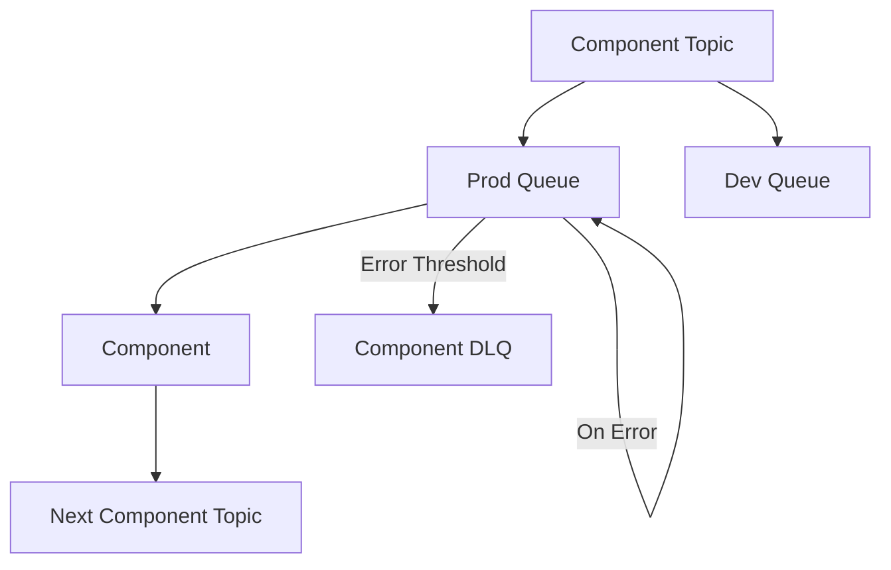

# Why AWS Requirements
Managing AWS Lambda's at a large scale can become quite tedious if not managed
correctly. There are a few ways that I have found working with Lambda to
make them a little more friendly to standard develpment practices.

# Components Model
By definining peices of your application as components we can easily wrap them
in the component requirements, such as SQS and SNS and acheive fan out and
hardening using the services themselves without having to worry about the
configuraiton of each piece.

[SQS DLQ Documentation](https://docs.aws.amazon.com/AWSSimpleQueueService/latest/SQSDeveloperGuide/sqs-dead-letter-queues.html)